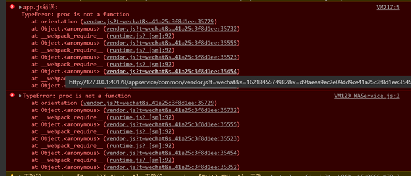
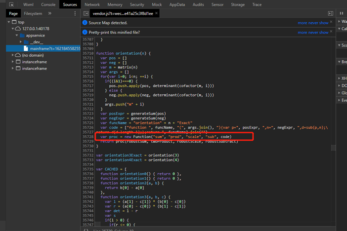
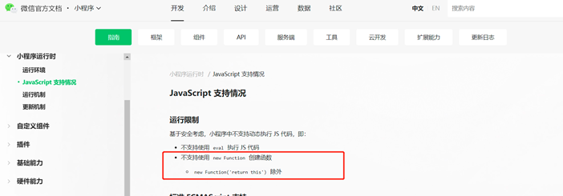
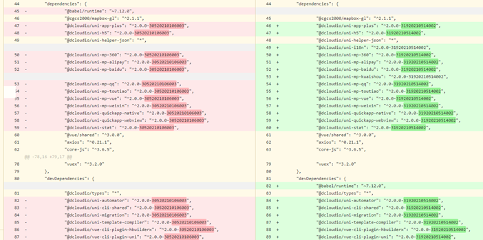

# uniapp运行微信小程序模拟器报错

### 报错信息

### 解决方案

打开微信开发者工具的设置，开启服务端口后重新运行即可

# 解决uniapp工程运行到微信小程序模拟器报proc is not function错误

### 现象

运行到微信小程序模拟器后，微信开发者工具提示如下错误

### 分析

查看编译后代码，发现new Fuction语句

根据[微信小程序运行时官方文档](https://developers.weixin.qq.com/miniprogram/dev/framework/runtime/js-support.html)，微信小程序不支持new Function创建函数。

升级如下package.json中的依赖工具后，重新运行——也尝试过清除微信开发者工具页面的缓存，仍旧报上述错误。

### 不优雅的解决方案

使用cli工具重新生成uniapp模板项目，迁移原项目便不报上述错误。